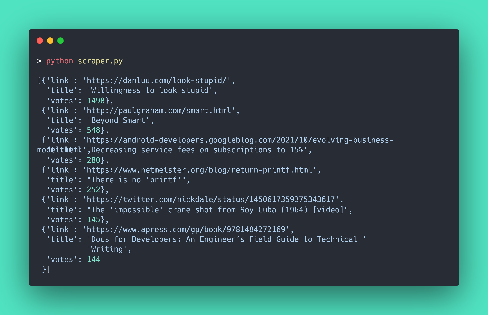

## News scraper

**Usage:** using this script you can get customized Hacker news, which has got more than 100 votes; with the help of [**`web scraping`**](https://en.wikipedia.orgHacker/wiki/Web_scraping).

----

### 📑 Libary references:

> 1. To scrape information from web pages - [**`Beautifulsoup4`**](https://pypi.org/project/beautifulsoup4/)
>
> 2. To send HTTP requests easily - [**`Requests`**](https://pypi.org/project/requests/)
>
> 3. To pretty-print data - [**`pprint`**](https://docs.python.org/3/library/pprint.html)

---

### Note :
> 1. Data scraping isn't allowed on all websites, so double check with the **`robots.txt`** on any website. [Try it out now](https://github.com/robots.txt)
>
> 2. Don't prefer web scraping at the first place, Rather make of use of `API's` which are provided by websites. 
>   For example, we can perform the same task using [HackerNews API](https://github.com/HackerNews/API)
>
> 3. If there isn't any API for a given website, then prefer going for web scraping in a ethical way.

---

### Console Output 

 
 
